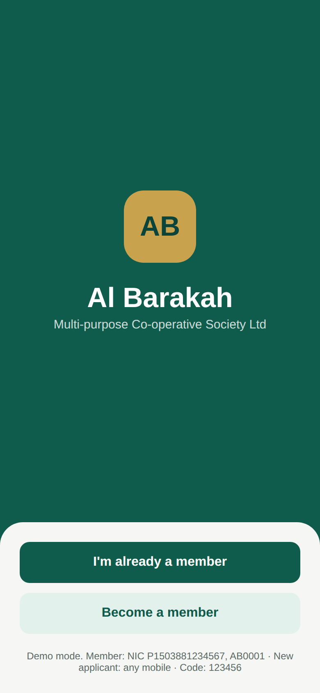
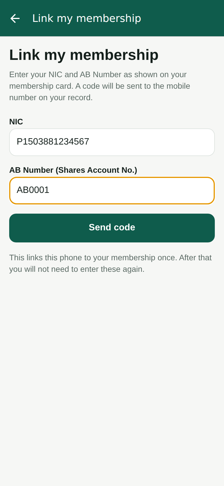
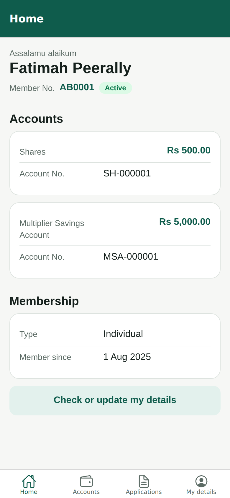
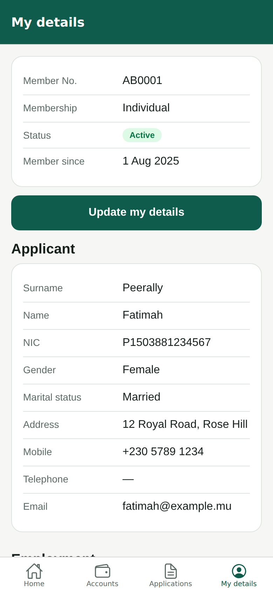
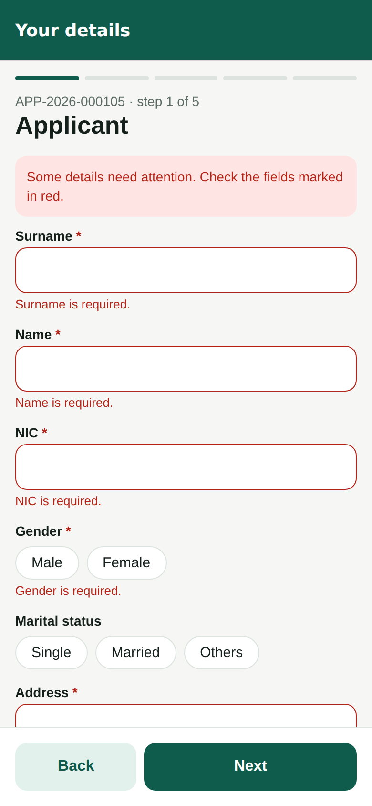
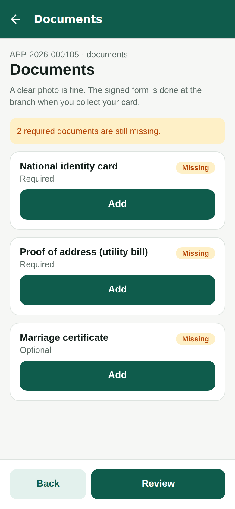
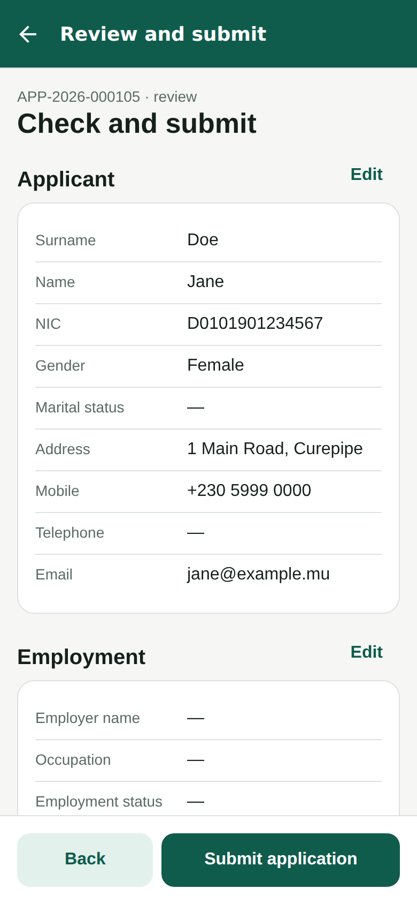
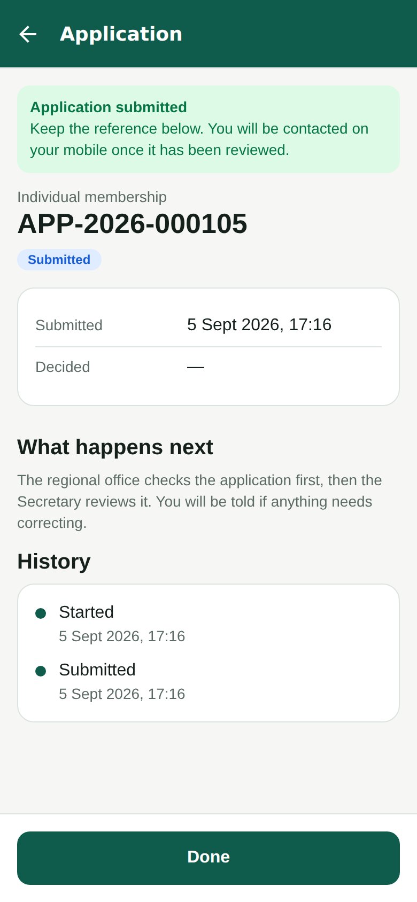

# Al Barakah — member mobile app

The member-facing app for Al Barakah MCSL, on iOS and Android from one
codebase. Two jobs:

1. **An existing member** links the phone to their membership once — NIC
   and AB Number, then a code sent to the mobile on their record — and from
   then on the stored session gets them in. They see their membership,
   accounts and documents, and capture or correct their own details, which
   staff verify before the record changes.
2. **A new applicant** applies to become a member from their phone: the same
   form the officer captures, the documents photographed on the spot, saved
   as they go and submitted into the same workflow.

The web application (`salmanmuddhoo/membership`) stays the system of record.
This app is a client of it, through a member-facing surface on its `/api/v1`
— see [`docs/member-api.md`](docs/member-api.md) for the contract, and for what the
web application has to add before the app can run against it.

## Run it

```bash
npm install
npm start          # Expo dev server; press a for Android, i for iOS, w for web
```

Without an `EXPO_PUBLIC_API_URL` the app runs against a built-in **mock
backend** that implements the whole contract in memory. Nothing to set up:

| Path                 | Enter                                   | Code     |
| -------------------- | --------------------------------------- | -------- |
| I'm already a member | NIC `P1503881234567`, AB Number `AB0001` | `123456` |
| Become a member      | any mobile, e.g. `5999 0000`             | `123456` |

To point at a real backend, copy `.env.example` to `.env` and set
`EXPO_PUBLIC_API_URL` (the web application's origin) and
`EXPO_PUBLIC_API_MODE=live`.

```bash
npm run typecheck  # tsc
npm run lint       # eslint (expo config)
npm test           # unit tests: phone rule, validation, the mock end to end
```

Scan the QR code with **Expo Go** on a phone to try it without a build. For
a store build, use EAS (`npx eas build`) — the app has no custom native code,
so no Xcode or Android Studio project is checked in.

## Why this stack

- **Expo + React Native + TypeScript.** One codebase for both platforms, the
  same language and conventions as the web application, and the people who
  maintain that can maintain this. Native controls, native performance for
  a forms-and-lists app; no web view.
- **Expo Router.** File-based routes (`app/`), deep links for free (an
  application reference in an SMS can open straight to it later).
- **React Query** for server state, so every screen has the same loading,
  error and pull-to-refresh behaviour and a mutation invalidates exactly
  what it changed.
- **SecureStore** for the session token (keychain / keystore), never
  AsyncStorage. AsyncStorage holds only what was typed into a form since
  the last save.
- **No UI library.** A dozen plain React Native controls in `src/ui`. Less
  to look wrong when the platforms change.

The alternatives — Flutter, or Kotlin and Swift separately — would each be
a second language and a second team for a small app whose only hard part
is agreeing the API. They are not worse; they are more.

## How it is put together

```text
app/                       routes (Expo Router)
├── (auth)/                welcome · link (NIC + AB Number) · sign-up (mobile) · verify
├── (member)/              tabs: home · accounts · applications · my details
├── (apply)/               choose type · [id]/form · documents · review · status
├── account/[id]           an account's transactions
└── details-edit           a member capturing their own details
src/
├── api/                   the contract (types.ts), the envelope-aware client,
│   │                      typed calls (member.ts), and the mock backend
│   └── mock/              reference.ts mirrors the web app's seed migrations
├── auth/                  session context + SecureStore
├── forms/                 the form engine: PartyForm renders a party from the
│                          membership type's field configuration; validate.ts
│                          mirrors capture.ts's mandatory-field rule
├── hooks/                 React Query hooks; the brokered upload
├── lib/                   phone.ts (port of the web app's E.164 rule), format
├── store/                 local draft copy
└── ui/                    theme + controls
tests/                     node tests, run with tsx
```

### The form is configuration, not code

Which fields an application has, which are mandatory, which subjects exist
(applicant, nominee, guardian, beneficiary, employment) and how many
nominees — all of it comes from the membership type configuration the web
application already serves (`GET /api/v1/config/reference`, exposed to
members as `GET /api/v1/member/reference`). `PartyForm` renders whatever it
is given. Adding a field to the Corporate form in Configuration adds it on
the phone with no release.

The same engine serves both jobs: the sign-up wizard walks one party per
step; "My details" shows every party on one screen, pre-filled.

### Saved as you go

Every step saves the draft to the server on Next. Whatever was typed since
the last successful save is also kept on the device and wins over the
server copy on return, so a dropped connection mid-form loses nothing
(the web app's S-302, on a phone). Nothing else is cached.

### Validation happens twice, on purpose

The phone checks a field as the person leaves it (a number it cannot place,
an email without an @, a mandatory field left blank) so the answer is
immediate. The server checks everything again at submit and returns
`validation_failed` with `details` keyed `subject.ordinal.fieldKey`; the
app folds those onto the same fields. Client validation is a courtesy;
server validation is the rule.

### Phone numbers

`src/lib/phone.ts` is a line-for-line port of the web application's
`toInternational`: Mauritian numbers become `+230…`, anything ambiguous is
refused rather than guessed. The unit tests pin the behaviour to the same
cases. If that rule changes in the web application, change it here too.

## Decisions to confirm with the business

These are the assumptions the app is built on. Each is a one-line change
if the decision goes the other way.

1. **Identification, verification and authentication are three things.**
   NIC + AB Number identify one active member; a code to the mobile on that
   member's record verifies the person; the session that results, held in
   the device keychain, authenticates every later request. NIC + AB Number
   on their own open nothing, and the internal `memberId` never reaches the
   phone. A new applicant needs no AB Number: their mobile is verified and
   the NIC goes on the application. See `docs/member-api.md`, "Identity".
2. **A member's own capture is a change request, not an edit.** Staff
   verify before the record changes; the audit trail shows who changed
   what. The app shows "pending" meanwhile.
3. **The signed form stays a branch step.** The app files the KYC
   documents; the applicant signs the printed form at the branch when they
   pay the fees. The signature modal in the web app exists for officers
   with a tablet, not for the applicant's own phone.
4. **One open application per person.** Starting a second while one is in
   progress is refused with the reference of the first.
5. **A Minor application is made by the guardian**, who signs in with
   their own number and enters the minor's details; the guardian block
   could be pre-filled from their record once the member API exposes it.

## Screens, in order

Welcome → Link my membership (NIC + AB Number) → Code → **Home** (member number, balances,
pending update) · **Accounts** → account → transactions · **Applications**
(status, returned comments) · **My details** (every section, documents on
file, expiring documents) → Complete / update my details → sent for
verification.

Become a member (mobile) → Code → Apply → choose membership type (fees, documents listed) → one step per
party → Documents (camera / photo / PDF, uploaded through the brokered
session) → Review (every gap named, Edit links) → Submitted (reference,
what happens next, history).

## Screenshots

Taken from the web build of the same code, driven through both flows by
Chromium (the smoke test in the PR description).

| Welcome | Link my membership | Home | My details |
| --- | --- | --- | --- |
|  |  |  |  |

| Form validation | Documents | Review | Submitted |
| --- | --- | --- | --- |
|  |  |  |  |
